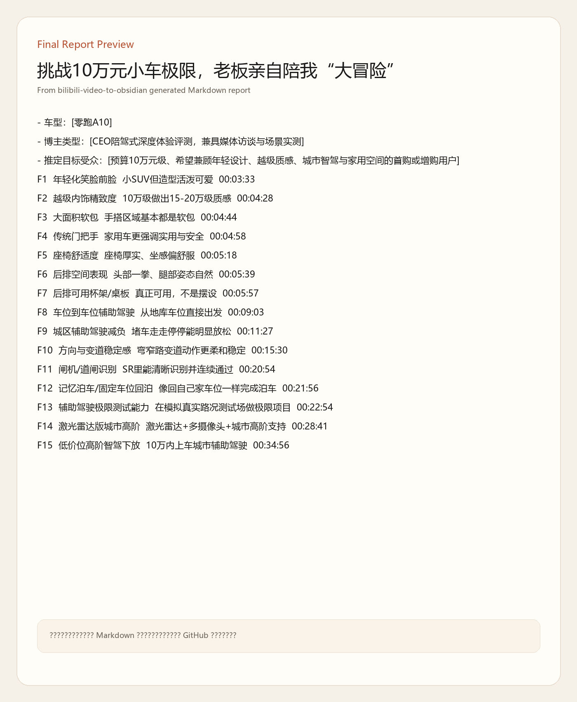
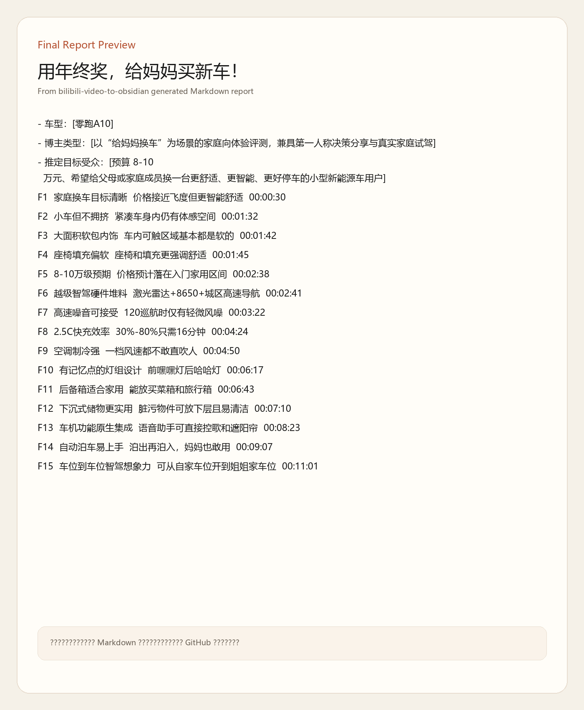

# Bilibili Car Video Analyzer

An OpenClaw-ready workflow package for turning Bilibili vehicle review videos into structured Obsidian notes.

The repo name stays `Bilibili_Car_video_Analyzer`, but the current workflow is no longer limited to passenger cars. It can also handle motorcycle / performance bike review content as long as the video has usable subtitles.

## What This Repo Does

Given one Bilibili video URL, the workflow will:

1. Validate the Bilibili login cookie before every run
2. Download the video
3. Extract subtitles
4. Stop immediately if no subtitle track is available
5. Generate a structured analysis Markdown note
6. Replace timestamp markers with real screenshots
7. Validate that every referenced asset exists
8. Publish the final note to Obsidian

## Guardrails

These rules are now built into the workflow and the skill:

- Cookie validation is mandatory before every run via `https://api.bilibili.com/x/web-interface/nav`
- If `isLogin != true`, the workflow must stop before download / subtitle / screenshot / publish
- No subtitle means no analysis; there is no ASR fallback in this skill
- Screenshot anchors must align to the actual feature / parameter sentence, not transition phrases
- The `时间戳截图` column must render images directly inside the table
- Table images in the feature overview section use width `300`
- Asset paths must use `assets/<noteFileName>/<generatedAttachmentFileName>`
- Publish must validate assets before and after copying to Obsidian
- Publish subdirectories must match content type

## Supported Content Types

The same workflow can now be used for different vehicle review content:

- Cars: publish to `汽车评测/<车型名>`
- Motorcycles: publish to `摩托评测/<车型名>`
- Other vehicle categories: publish to the closest matching top-level folder and keep the note wording consistent

## Final Output

Each successful run produces a dedicated folder:

```text
./<video-title>/
├─ <video-title>.md
├─ <video-title>.mp4
├─ <video-title>.srt
└─ assets/
   └─ <video-title>/
```

The note itself includes:

- Video metadata
- Feature overview table
- Core feature identification
- Deep-dive analysis
- Overall evaluation
- Timestamp-aligned screenshots

## Final Report Previews

### IM LS8 Preview


### Leapmotor A10 Preview



### Leapmotor A10 Family Purchase Preview



## Repository Layout

```text
.
├─ skills/
│  └─ bilibili-video-to-obsidian/
│     ├─ SKILL.md
│     └─ agents/
│        └─ openai.yaml
├─ scripts/
│  ├─ bilibili_subtitle_batch.py
│  ├─ feature_anchor_helper.py
│  ├─ publish_to_obsidian.py
│  ├─ screenshot.py
│  └─ video_note_pipeline.py
├─ .config/
│  ├─ bili_cookie.txt.example
│  └─ obsidian_vault_path.txt.example
├─ docs/
│  └─ report-previews/
└─ OPENCLAW_IMPORT.md
```

## Requirements

- `python3`
- `yt-dlp`
- `ffmpeg`

## Config

### 1. Obsidian vault path

Copy:

```text
.config/obsidian_vault_path.txt.example
```

to:

```text
.config/obsidian_vault_path.txt
```

Then write your absolute Obsidian vault path into it.

### 2. Bilibili cookie

Copy:

```text
.config/bili_cookie.txt.example
```

to:

```text
.config/bili_cookie.txt
```

Use a valid logged-in raw `Cookie:` header. The workflow now checks login status before every run, so stale cookies will fail fast.

## Quick Start

### 1. Download video and extract subtitles

```powershell
python .\scripts\video_note_pipeline.py "<bilibili-video-url>"
```

### 2. Generate screenshots and finalize the Markdown note

```powershell
python .\scripts\screenshot.py
```

### 3. Publish to Obsidian

Car example:

```powershell
python .\scripts\publish_to_obsidian.py "<path-to-note.md>" --subdir "汽车评测/<车型名>"
```

Motorcycle example:

```powershell
python .\scripts\publish_to_obsidian.py "<path-to-note.md>" --subdir "摩托评测/<车型名>"
```

## OpenClaw Import

This repository is already organized as an OpenClaw-friendly workspace.

OpenClaw can discover the skill from:

```text
./skills/bilibili-video-to-obsidian/
```

For detailed import instructions, see [OPENCLAW_IMPORT.md](./OPENCLAW_IMPORT.md).

## Why This Repo Exists

This repo is meant to be a reusable execution package, not just a loose prompt or documentation note.

It specifically locks down the failure-prone parts of the workflow:

- no fake analysis when subtitles are missing
- no screenshot timestamps that point to transition lines
- no missing copied assets in Obsidian
- no accidental use of `README.md` / `OPENCLAW_IMPORT.md` as the analysis source
- no silent runs under an expired Bilibili login state
