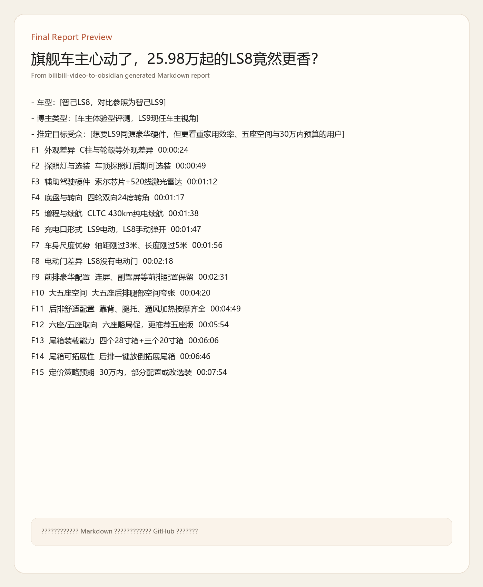
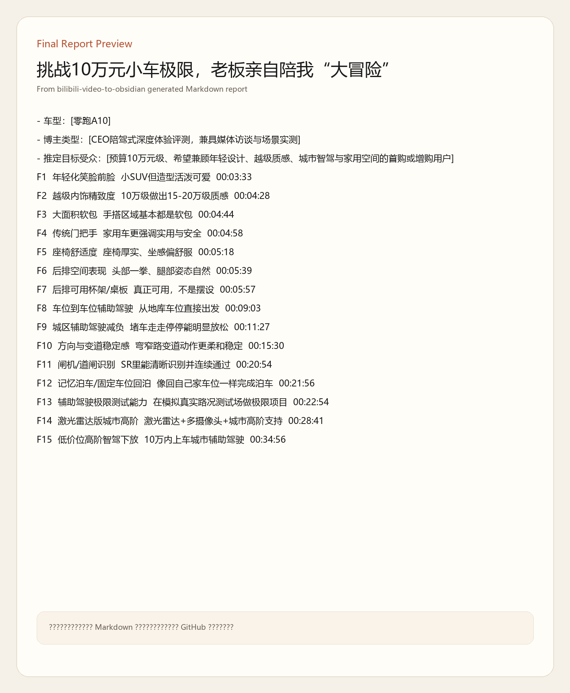
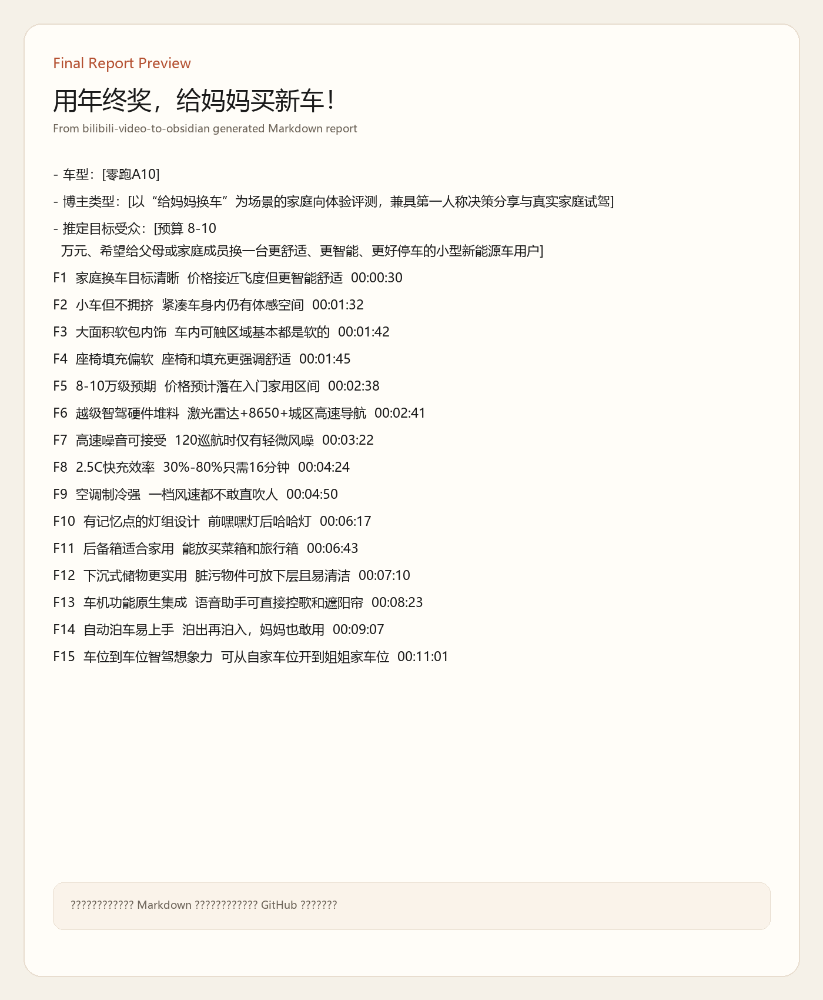

# Bilibili_Car_video_Analyzer

`Bilibili_Car_video_Analyzer` 是一个面向 B 站汽车内容的视频分析工作流。它会基于字幕生成结构化 Markdown，按核心信息点截取视频画面，并把最终笔记发布到 Obsidian 或飞书云文档。

这个项目适合处理汽车发布会、车型评测、产品解读、购车建议等视频。只要视频有可用字幕，就可以把长视频沉淀成带时间戳证据、截图和分析结论的知识库笔记。

## 主要能力

- 校验 Bilibili 登录 Cookie，避免过期 Cookie 造成后续流程假成功
- 下载 B 站视频并提取字幕
- 无字幕时立即停止，不伪造分析
- 基于字幕生成商业评测/产品分析 Markdown
- 按“功能点、参数、价值表达”选择时间戳截图
- 校验本地截图资源，避免 Markdown 里出现断图
- 发布到 Obsidian 指定目录
- 按顺序插入图片到飞书云文档，避免图片集中堆成截图画廊
- 作为 OpenClaw / Codex skill 复用整套流程

## 工作流产物

每处理一个视频，会生成一个独立目录：

```text
./<视频标题>/
├─ <视频标题>.md
├─ <视频标题>.mp4
├─ <视频标题>.srt
└─ assets/
   └─ <安全资产目录>/
      ├─ screenshot_*.jpg
      └─ ...
```

最终 Markdown 通常包含：

- 视频基础信息
- 核心功能/卖点总览
- 时间戳截图表格
- 深度分析
- 产品价值判断
- 可追溯的字幕与截图证据

## 目录结构

```text
.
├─ scripts/
│  ├─ bilibili_subtitle_batch.py      # 字幕提取
│  ├─ feature_anchor_helper.py        # 功能点锚点辅助
│  ├─ publish_to_obsidian.py          # 发布到 Obsidian
│  ├─ screenshot.py                   # 按时间戳截图并修正 Markdown
│  └─ video_note_pipeline.py          # 下载、字幕、归档主流程
├─ skills/
│  └─ bilibili-car-video-analyzer/
│     ├─ SKILL.md
│     └─ agents/
│        └─ openai.yaml
├─ .config/
│  ├─ bili_cookie.txt.example
│  └─ obsidian_vault_path.txt.example
├─ docs/
│  └─ report-previews/
└─ OPENCLAW_IMPORT.md
```

## 环境依赖

请先准备：

- Python 3
- `yt-dlp`
- `ffmpeg`
- 可用的 Bilibili 登录 Cookie
- 可选：Obsidian 本地库
- 可选：已登录的飞书 / Lark CLI

## 配置

### 1. 配置 Bilibili Cookie

复制示例文件：

```bash
cp .config/bili_cookie.txt.example .config/bili_cookie.txt
```

把浏览器里复制出来的完整 Cookie 写入：

```text
.config/bili_cookie.txt
```

流程会在每次运行前访问：

```text
https://api.bilibili.com/x/web-interface/nav
```

如果返回结果不是已登录状态，流程会直接停止。

### 2. 配置 Obsidian 库路径

如果需要发布到 Obsidian，复制示例文件：

```bash
cp .config/obsidian_vault_path.txt.example .config/obsidian_vault_path.txt
```

然后写入你的 Obsidian vault 绝对路径。

也可以运行发布脚本时显式传入：

```bash
python3 scripts/publish_to_obsidian.py "<path-to-note.md>" --vault "<obsidian-vault-path>" --subdir "汽车评测/<车型名>"
```

## 快速开始

### 1. 下载视频并提取字幕

```bash
python3 scripts/video_note_pipeline.py "<bilibili-video-url>"
```

如果视频没有字幕，流程应停止，不继续生成分析。

### 2. 生成或修正 Markdown 截图

```bash
python3 scripts/screenshot.py
```

如果需要指定某一篇 Markdown：

```bash
python3 scripts/screenshot.py --markdown "<path-to-note.md>"
```

### 3. 发布到 Obsidian

汽车内容示例：

```bash
python3 scripts/publish_to_obsidian.py "<path-to-note.md>" --subdir "汽车评测/<车型名>"
```

摩托车内容示例：

```bash
python3 scripts/publish_to_obsidian.py "<path-to-note.md>" --subdir "摩托评测/<车型名>"
```

## 飞书云文档发布建议

飞书对 Markdown 本地图片导入并不稳定。实践中，直接导入 Markdown 或 docx 可能出现“无法导入”的图片占位。

更可靠的做法是：

1. 将 Markdown 拆成有序文本块
2. 先创建飞书文档
3. 按顺序追加文本块
4. 每写完一个需要截图的时间戳段落，就立刻插入对应图片
5. 最后用 `docs +fetch` 检查文档里没有“无法导入”，图片也没有全部堆在文末

这套经验已经写入 skill 的飞书发布规则中。

## OpenClaw / Codex Skill

本项目内置 skill：

```text
skills/bilibili-car-video-analyzer/
```

导入后可以这样使用：

```text
使用 Bilibili_Car_Video_Analyzer skill 分析这个 B 站汽车视频链接，并发布到 Obsidian 或飞书
```

详细导入说明见：

```text
OPENCLAW_IMPORT.md
```

## 关键规则

### 字幕规则

- 必须基于字幕分析，不靠标题或简介猜测
- 没有字幕就停止
- 不做 ASR 兜底分析

### 截图规则

- 时间戳必须落在核心词、参数、功能点实际出现的位置
- 不能用“我们看这里”“接下来”“这个地方”等过渡句做截图锚点
- 如果字幕块从 `00:22:50` 开始，但核心词“22度”出现在 `00:22:56` 附近，就应截取 `00:22:56`，而不是默认用字幕块起点
- Markdown 表格里的“时间戳截图”列必须直接显示图片
- 图片路径要使用安全目录名，避免 `#` 等字符导致 Obsidian 或 HTML 解析失败

### 发布规则

- 发布前后都要校验图片是否存在
- Obsidian 路径无效时，不能声称发布成功
- 飞书文档不能把所有截图堆到最后，除非用户明确要求截图画廊

## 预览

### 智己 LS8 报告预览



### 零跑 A10 报告预览



### 零跑 A10 家庭购车报告预览



## 安全说明

不要提交真实 Cookie、Obsidian 私人路径、视频原片、浏览器 profile 或临时截图目录。

仓库只保留：

- 示例配置
- 可复用脚本
- skill 说明
- 文档和预览图

## 许可

当前项目主要作为个人工作流和 OpenClaw/Codex skill 发布包使用。公开复用前，请自行确认 Bilibili 视频、截图和下游笔记内容的版权与使用范围。
